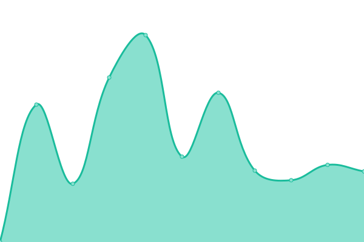

# [📈 Live Status](https://zkitefly.github.io/upptime): <!--live status--> **🟧 Partial outage**

This repository contains the open-source uptime monitor and status page for [Zkitefly](https://zkitefly.github.io), powered by [Upptime](https://github.com/upptime/upptime).

With [Upptime](https://upptime.js.org), you can get your own unlimited and free uptime monitor and status page, powered entirely by a GitHub repository. We use [Issues](https://github.com/zkitefly/upptime/issues) as incident reports, [Actions](https://github.com/zkitefly/upptime/actions) as uptime monitors, and [Pages](https://zkitefly.github.io/upptime) for the status page.

<!--start: status pages-->
<!-- This summary is generated by Upptime (https://github.com/upptime/upptime) -->
<!-- Do not edit this manually, your changes will be overwritten -->
<!-- prettier-ignore -->
| URL | Status | History | Response Time | Uptime |
| --- | ------ | ------- | ------------- | ------ |
|  [Hello Minecraft! Launcher - HMCL official website](https://hmcl.huangyuhui.net/) | 🟩 Up | [hello-minecraft-launcher-hmcl-official-website.yml](https://github.com/zkitefly/upptime/commits/HEAD/history/hello-minecraft-launcher-hmcl-official-website.yml) | 

 1218ms
     
 | 

<a href="https://zkitefly.github.io/upptime/history/hello-minecraft-launcher-hmcl-official-website">100.00%</a>
    

|  [Hello Minecraft! Launcher - HMCL CI/CD website](https://ci.huangyuhui.net/) | 🟩 Up | [hello-minecraft-launcher-hmcl-ci-cd-website.yml](https://github.com/zkitefly/upptime/commits/HEAD/history/hello-minecraft-launcher-hmcl-ci-cd-website.yml) | 

 1801ms
     
 | 

<a href="https://zkitefly.github.io/upptime/history/hello-minecraft-launcher-hmcl-ci-cd-website">100.00%</a>
    

|  [Hello Minecraft! Launcher - HMCL stable update link](https://hmcl.huangyuhui.net/api/update_link?version=3.5.9&channel=stable) | 🟩 Up | [hello-minecraft-launcher-hmcl-stable-update-link.yml](https://github.com/zkitefly/upptime/commits/HEAD/history/hello-minecraft-launcher-hmcl-stable-update-link.yml) | 

 274ms
     
 | 

<a href="https://zkitefly.github.io/upptime/history/hello-minecraft-launcher-hmcl-stable-update-link">100.00%</a>
    

|  [Hello Minecraft! Launcher - HMCL dev update link](https://hmcl.huangyuhui.net/api/update_link?version=3.5.9&channel=dev) | 🟩 Up | [hello-minecraft-launcher-hmcl-dev-update-link.yml](https://github.com/zkitefly/upptime/commits/HEAD/history/hello-minecraft-launcher-hmcl-dev-update-link.yml) | 

 274ms
     
 | 

<a href="https://zkitefly.github.io/upptime/history/hello-minecraft-launcher-hmcl-dev-update-link">100.00%</a>
    

|  [Hello Minecraft! Launcher - HMCL Docs](https://docs.hmcl.net/) | 🟩 Up | [hello-minecraft-launcher-hmcl-docs.yml](https://github.com/zkitefly/upptime/commits/HEAD/history/hello-minecraft-launcher-hmcl-docs.yml) | 

 1067ms
     
 | 

<a href="https://zkitefly.github.io/upptime/history/hello-minecraft-launcher-hmcl-docs">100.00%</a>
    

|  [Minecraft Forge - Forge official download files website](https://files.minecraftforge.net/net/minecraftforge/forge/) | 🟩 Up | [minecraft-forge-forge-official-download-files-website.yml](https://github.com/zkitefly/upptime/commits/HEAD/history/minecraft-forge-forge-official-download-files-website.yml) | 

 159ms
     
 | 

<a href="https://zkitefly.github.io/upptime/history/minecraft-forge-forge-official-download-files-website">100.00%</a>
    

|  [Minecraft Forge - hmcl-dev.github.io/metadata/forge/index.json](https://hmcl-dev.github.io/metadata/forge/index.json) | 🟩 Up | [minecraft-forge-hmcl-dev-github-io-metadata-forge-index-json.yml](https://github.com/zkitefly/upptime/commits/HEAD/history/minecraft-forge-hmcl-dev-github-io-metadata-forge-index-json.yml) | 

 164ms
     
 | 

<a href="https://zkitefly.github.io/upptime/history/minecraft-forge-hmcl-dev-github-io-metadata-forge-index-json">100.00%</a>
    

|  [Minecraft Forge - zkitefly.github.io/forge-maven-metadata/list.json](https://zkitefly.github.io/forge-maven-metadata/list.json) | 🟩 Up | [minecraft-forge-zkitefly-github-io-forge-maven-metadata-list-json.yml](https://github.com/zkitefly/upptime/commits/HEAD/history/minecraft-forge-zkitefly-github-io-forge-maven-metadata-list-json.yml) | 

 146ms
     
 | 

<a href="https://zkitefly.github.io/upptime/history/minecraft-forge-zkitefly-github-io-forge-maven-metadata-list-json">100.00%</a>
    

|  [OptiFine - OptiFine official website](https://www.optifine.net/) | 🟩 Up | [opti-fine-opti-fine-official-website.yml](https://github.com/zkitefly/upptime/commits/HEAD/history/opti-fine-opti-fine-official-website.yml) | 

 363ms
     
 | 

<a href="https://zkitefly.github.io/upptime/history/opti-fine-opti-fine-official-website">100.00%</a>
    

|  [OptiFine - hmcl-dev.github.io/metadata/optifine/index.json](https://hmcl-dev.github.io/metadata/optifine/index.json) | 🟩 Up | [opti-fine-hmcl-dev-github-io-metadata-optifine-index-json.yml](https://github.com/zkitefly/upptime/commits/HEAD/history/opti-fine-hmcl-dev-github-io-metadata-optifine-index-json.yml) | 

 42ms
     
 | 

<a href="https://zkitefly.github.io/upptime/history/opti-fine-hmcl-dev-github-io-metadata-optifine-index-json">100.00%</a>
    

|  [OptiFine - zkitefly.github.io/optifine-download-list/index.json](https://zkitefly.github.io/optifine-download-list/index.json) | 🟩 Up | [opti-fine-zkitefly-github-io-optifine-download-list-index-json.yml](https://github.com/zkitefly/upptime/commits/HEAD/history/opti-fine-zkitefly-github-io-optifine-download-list-index-json.yml) | 

 58ms
     
 | 

<a href="https://zkitefly.github.io/upptime/history/opti-fine-zkitefly-github-io-optifine-download-list-index-json">100.00%</a>
    

|  [OptiFine - of-302v.zkitefly.eu.org](https://of-302v.zkitefly.eu.org/file/OptiFine_1.20.4_HD_U_I7.jar) | 🟩 Up | [opti-fine-of-302v-zkitefly-eu-org.yml](https://github.com/zkitefly/upptime/commits/HEAD/history/opti-fine-of-302v-zkitefly-eu-org.yml) | 

 5447ms
     
 | 

<a href="https://zkitefly.github.io/upptime/history/opti-fine-of-302v-zkitefly-eu-org">99.24%</a>
    

|  [OptiFine - of-302.zkitefly.eu.org](https://of-302.zkitefly.eu.org/file/OptiFine_1.20.4_HD_U_I7.jar) | 🟩 Up | [opti-fine-of-302-zkitefly-eu-org.yml](https://github.com/zkitefly/upptime/commits/HEAD/history/opti-fine-of-302-zkitefly-eu-org.yml) | 

 2684ms
     
 | 

<a href="https://zkitefly.github.io/upptime/history/opti-fine-of-302-zkitefly-eu-org">100.00%</a>
    

|  [OptiFine - of-302.burningtnt.workers.dev](https://of-302.burningtnt.workers.dev/file/OptiFine_1.20.4_HD_U_I7.jar) | 🟩 Up | [opti-fine-of-302-burningtnt-workers-dev.yml](https://github.com/zkitefly/upptime/commits/HEAD/history/opti-fine-of-302-burningtnt-workers-dev.yml) | 

 2193ms
     
 | 

<a href="https://zkitefly.github.io/upptime/history/opti-fine-of-302-burningtnt-workers-dev">100.00%</a>
    

|  [Unlisted versions of Minecraft - zkitefly.github.io/minecraft-unlisted-version-list/version_manifest.json](https://zkitefly.github.io/unlisted-versions-of-minecraft/version_manifest.json) | 🟩 Up | [unlisted-versions-of-minecraft-zkitefly-github-io-minecraft-unlisted-version-list-version-manifest-json.yml](https://github.com/zkitefly/upptime/commits/HEAD/history/unlisted-versions-of-minecraft-zkitefly-github-io-minecraft-unlisted-version-list-version-manifest-json.yml) | 

 97ms
     
 | 

<a href="https://zkitefly.github.io/upptime/history/unlisted-versions-of-minecraft-zkitefly-github-io-minecraft-unlisted-version-list-version-manifest-json">100.00%</a>
    

|  [Unlisted versions of Minecraft - zkitefly.github.io/unlisted-versions-of-minecraft/files/1_2/1_2.jar](https://zkitefly.github.io/unlisted-versions-of-minecraft/files/1_2/1_2.jar) | 🟩 Up | [unlisted-versions-of-minecraft-zkitefly-github-io-unlisted-versions-of-minecraft-files-1-2-1-2-jar.yml](https://github.com/zkitefly/upptime/commits/HEAD/history/unlisted-versions-of-minecraft-zkitefly-github-io-unlisted-versions-of-minecraft-files-1-2-1-2-jar.yml) | 

 211ms
     
 | 

<a href="https://zkitefly.github.io/upptime/history/unlisted-versions-of-minecraft-zkitefly-github-io-unlisted-versions-of-minecraft-files-1-2-1-2-jar">100.00%</a>
    

|  [Unlisted versions of Minecraft - alist.8mi.tech/d/mirror/unlisted-versions-of-minecraft/Auto/version_manifest.json](https://alist.8mi.tech/d/mirror/unlisted-versions-of-minecraft/Auto/version_manifest.json) | 🟩 Up | [unlisted-versions-of-minecraft-alist-8mi-tech-d-mirror-unlisted-versions-of-minecraft-auto-version-manifest-json.yml](https://github.com/zkitefly/upptime/commits/HEAD/history/unlisted-versions-of-minecraft-alist-8mi-tech-d-mirror-unlisted-versions-of-minecraft-auto-version-manifest-json.yml) | 

 4843ms
     
 | 

<a href="https://zkitefly.github.io/upptime/history/unlisted-versions-of-minecraft-alist-8mi-tech-d-mirror-unlisted-versions-of-minecraft-auto-version-manifest-json">100.00%</a>
    

|  [Unlisted versions of Minecraft - alist.8mi.tech/d/mirror/unlisted-versions-of-minecraft/Auto/files/1_2/1_2.jar](https://alist.8mi.tech/d/mirror/unlisted-versions-of-minecraft/Auto/files/1_2/1_2.jar) | 🟩 Up | [unlisted-versions-of-minecraft-alist-8mi-tech-d-mirror-unlisted-versions-of-minecraft-auto-files-1-2-1-2-jar.yml](https://github.com/zkitefly/upptime/commits/HEAD/history/unlisted-versions-of-minecraft-alist-8mi-tech-d-mirror-unlisted-versions-of-minecraft-auto-files-1-2-1-2-jar.yml) | 

 2818ms
     
 | 

<a href="https://zkitefly.github.io/upptime/history/unlisted-versions-of-minecraft-alist-8mi-tech-d-mirror-unlisted-versions-of-minecraft-auto-files-1-2-1-2-jar">100.00%</a>
    

|  [Fold Craft Launcher - Fold Craft Launcher update link in Chinese](http://101.43.66.4:1145/api/getupdate) | 🟥 Down | [fold-craft-launcher-fold-craft-launcher-update-link-in-chinese.yml](https://github.com/zkitefly/upptime/commits/HEAD/history/fold-craft-launcher-fold-craft-launcher-update-link-in-chinese.yml) | 

 0ms
     
 | 

<a href="https://zkitefly.github.io/upptime/history/fold-craft-launcher-fold-craft-launcher-update-link-in-chinese">100.00%</a>
    

|  [BakaXL - BakaXL official website](https://www.bakaxl.com/) | 🟩 Up | [baka-xl-baka-xl-official-website.yml](https://github.com/zkitefly/upptime/commits/HEAD/history/baka-xl-baka-xl-official-website.yml) | 

 1038ms
     
 | 

<a href="https://zkitefly.github.io/upptime/history/baka-xl-baka-xl-official-website">98.39%</a>
    

|  [BakaXL - BakaXL localization platform](https://translate.baka.zone/) | 🟥 Down | [baka-xl-baka-xl-localization-platform.yml](https://github.com/zkitefly/upptime/commits/HEAD/history/baka-xl-baka-xl-localization-platform.yml) | 

 0ms
     
 | 

<a href="https://zkitefly.github.io/upptime/history/baka-xl-baka-xl-localization-platform">0.00%</a>
    

|  [BakaXL - BakaXL 3.0 CI/CD website](http://jk-insider.bakaxl.com:8888/) | 🟩 Up | [baka-xl-baka-xl-3-0-ci-cd-website.yml](https://github.com/zkitefly/upptime/commits/HEAD/history/baka-xl-baka-xl-3-0-ci-cd-website.yml) | 

 1432ms
     
 | 

<a href="https://zkitefly.github.io/upptime/history/baka-xl-baka-xl-3-0-ci-cd-website">100.00%</a>
    

|  [PCL - mfn233/PCL-Mainpage 主页预设：简单主页](https://gitee.com/mfn233/PCL-Mainpage/raw/main/Custom.xaml) | 🟥 Down | [pcl-mfn233-pcl-mainpage.yml](https://github.com/zkitefly/upptime/commits/HEAD/history/pcl-mfn233-pcl-mainpage.yml) | 

 2787ms
     
 | 

<a href="https://zkitefly.github.io/upptime/history/pcl-mfn233-pcl-mainpage">99.98%</a>
    

|  [PCL - pclsub.sodamc.com 主页预设：每日整合包推荐](https://pclsub.sodamc.com/) | 🟩 Up | [pcl-pclsub-sodamc-com.yml](https://github.com/zkitefly/upptime/commits/HEAD/history/pcl-pclsub-sodamc-com.yml) | 

 1445ms
     
 | 

<a href="https://zkitefly.github.io/upptime/history/pcl-pclsub-sodamc-com">99.52%</a>
    

|  [PCL - forgepixel.com/pcl_sub_file 主页预设：Minecraft 皮肤推荐](https://forgepixel.com/pcl_sub_file) | 🟩 Up | [pcl-forgepixel-com-pcl-sub-file-minecraft.yml](https://github.com/zkitefly/upptime/commits/HEAD/history/pcl-forgepixel-com-pcl-sub-file-minecraft.yml) | 

 2071ms
     
 | 

<a href="https://zkitefly.github.io/upptime/history/pcl-forgepixel-com-pcl-sub-file-minecraft">99.22%</a>
    

|  [CrashMC - CrashMC official website](https://crashmc.com/) | 🟩 Up | [crash-mc-crash-mc-official-website.yml](https://github.com/zkitefly/upptime/commits/HEAD/history/crash-mc-crash-mc-official-website.yml) | 

 333ms
     
 | 

<a href="https://zkitefly.github.io/upptime/history/crash-mc-crash-mc-official-website">100.00%</a>
    

|  [BetaCraft - BetaCraft official website](https://betacraft.uk/) | 🟩 Up | [beta-craft-beta-craft-official-website.yml](https://github.com/zkitefly/upptime/commits/HEAD/history/beta-craft-beta-craft-official-website.yml) | 

 728ms
     
 | 

<a href="https://zkitefly.github.io/upptime/history/beta-craft-beta-craft-official-website">100.00%</a>
    

|  [AFdian - AFdian mirror website](https://afdian.com/) | 🟩 Up | [a-fdian-a-fdian-mirror-website.yml](https://github.com/zkitefly/upptime/commits/HEAD/history/a-fdian-a-fdian-mirror-website.yml) | 

 931ms
     
 | 

<a href="https://zkitefly.github.io/upptime/history/a-fdian-a-fdian-mirror-website">100.00%</a>
    

|  [WenShuShu - WenShuShu official website](https://www.wenshushu.cn/) | 🟩 Up | [wen-shu-shu-wen-shu-shu-official-website.yml](https://github.com/zkitefly/upptime/commits/HEAD/history/wen-shu-shu-wen-shu-shu-official-website.yml) | 

 2155ms
     
 | 

<a href="https://zkitefly.github.io/upptime/history/wen-shu-shu-wen-shu-shu-official-website">98.56%</a>
    

|  [alist - 8mi](https://alist.8mi.tech) | 🟩 Up | [alist-8mi.yml](https://github.com/zkitefly/upptime/commits/HEAD/history/alist-8mi.yml) | 

 108ms
     
 | 

<a href="https://zkitefly.github.io/upptime/history/alist-8mi">99.11%</a>
    

|  [alist - 8mi microsoft-jdk-21-windows-x64.msi](https://alist.8mi.tech/d/mirror/ms-jdk/Auto/microsoft-jdk-21-windows-x64.msi) | 🟩 Up | [alist-8mi-microsoft-jdk-21-windows-x64-msi.yml](https://github.com/zkitefly/upptime/commits/HEAD/history/alist-8mi-microsoft-jdk-21-windows-x64-msi.yml) | 

 16923ms
     
 | 

<a href="https://zkitefly.github.io/upptime/history/alist-8mi-microsoft-jdk-21-windows-x64-msi">99.11%</a>
    

|  [alist - 8mi microsoft-jdk-21-windows-aarch64.msi](https://alist.8mi.tech/d/mirror/ms-jdk/Auto/microsoft-jdk-21-windows-aarch64.msi) | 🟩 Up | [alist-8mi-microsoft-jdk-21-windows-aarch64-msi.yml](https://github.com/zkitefly/upptime/commits/HEAD/history/alist-8mi-microsoft-jdk-21-windows-aarch64-msi.yml) | 

 14404ms
     
 | 

<a href="https://zkitefly.github.io/upptime/history/alist-8mi-microsoft-jdk-21-windows-aarch64-msi">98.73%</a>
    

<!--end: status pages-->

[**Visit our status website →**](https://zkitefly.github.io/upptime)

## 📄 License

- Powered by: [Upptime](https://github.com/upptime/upptime)
- Code: [MIT](./LICENSE) © [Anand Chowdhary](https://anandchowdhary.com), supported by [Pabio](https://pabio.com)
- Data in the `./history` directory: [Open Database License](https://opendatacommons.org/licenses/odbl/1-0/)
