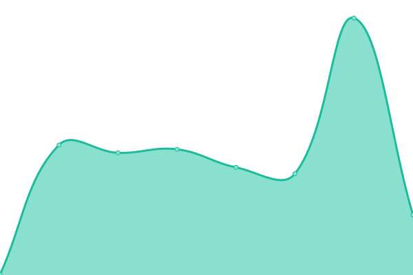

# [📈 Live Status](https://zkitefly.github.io/upptime): <!--live status--> **🟧 Partial outage**

This repository contains the open-source uptime monitor and status page for [Zkitefly](https://zkitefly.github.io), powered by [Upptime](https://github.com/upptime/upptime).

With [Upptime](https://upptime.js.org), you can get your own unlimited and free uptime monitor and status page, powered entirely by a GitHub repository. We use [Issues](https://github.com/zkitefly/upptime/issues) as incident reports, [Actions](https://github.com/zkitefly/upptime/actions) as uptime monitors, and [Pages](https://zkitefly.github.io/upptime) for the status page.

<!--start: status pages-->
<!-- This summary is generated by Upptime (https://github.com/upptime/upptime) -->
<!-- Do not edit this manually, your changes will be overwritten -->
<!-- prettier-ignore -->
| URL | Status | History | Response Time | Uptime |
| --- | ------ | ------- | ------------- | ------ |
|  [Hello Minecraft! Launcher - HMCL official website](https://hmcl.huangyuhui.net/) | 🟩 Up | [hello-minecraft-launcher-hmcl-official-website.yml](https://github.com/zkitefly/upptime/commits/HEAD/history/hello-minecraft-launcher-hmcl-official-website.yml) | 

 1126ms
     
 | 

<a href="https://zkitefly.github.io/upptime/history/hello-minecraft-launcher-hmcl-official-website">100.00%</a>
    

|  [Hello Minecraft! Launcher - HMCL CI/CD website](https://ci.huangyuhui.net/) | 🟩 Up | [hello-minecraft-launcher-hmcl-ci-cd-website.yml](https://github.com/zkitefly/upptime/commits/HEAD/history/hello-minecraft-launcher-hmcl-ci-cd-website.yml) | 

 1263ms
     
 | 

<a href="https://zkitefly.github.io/upptime/history/hello-minecraft-launcher-hmcl-ci-cd-website">100.00%</a>
    

|  [Hello Minecraft! Launcher - HMCL stable update link](https://hmcl.huangyuhui.net/api/update_link?version=3.5.9&channel=stable) | 🟩 Up | [hello-minecraft-launcher-hmcl-stable-update-link.yml](https://github.com/zkitefly/upptime/commits/HEAD/history/hello-minecraft-launcher-hmcl-stable-update-link.yml) | 

 256ms
     
 | 

<a href="https://zkitefly.github.io/upptime/history/hello-minecraft-launcher-hmcl-stable-update-link">100.00%</a>
    

|  [Hello Minecraft! Launcher - HMCL dev update link](https://hmcl.huangyuhui.net/api/update_link?version=3.5.9&channel=dev) | 🟩 Up | [hello-minecraft-launcher-hmcl-dev-update-link.yml](https://github.com/zkitefly/upptime/commits/HEAD/history/hello-minecraft-launcher-hmcl-dev-update-link.yml) | 

 362ms
     
 | 

<a href="https://zkitefly.github.io/upptime/history/hello-minecraft-launcher-hmcl-dev-update-link">100.00%</a>
    

|  [Hello Minecraft! Launcher - HMCL Docs](https://docs.hmcl.net/) | 🟩 Up | [hello-minecraft-launcher-hmcl-docs.yml](https://github.com/zkitefly/upptime/commits/HEAD/history/hello-minecraft-launcher-hmcl-docs.yml) | 

 1020ms
     
 | 

<a href="https://zkitefly.github.io/upptime/history/hello-minecraft-launcher-hmcl-docs">100.00%</a>
    

|  [Minecraft Forge - Forge official download files website](https://files.minecraftforge.net/net/minecraftforge/forge/) | 🟩 Up | [minecraft-forge-forge-official-download-files-website.yml](https://github.com/zkitefly/upptime/commits/HEAD/history/minecraft-forge-forge-official-download-files-website.yml) | 

 201ms
     
 | 

<a href="https://zkitefly.github.io/upptime/history/minecraft-forge-forge-official-download-files-website">100.00%</a>
    

|  [Minecraft Forge - hmcl-dev.github.io/metadata/forge/index.json](https://hmcl-dev.github.io/metadata/forge/index.json) | 🟩 Up | [minecraft-forge-hmcl-dev-github-io-metadata-forge-index-json.yml](https://github.com/zkitefly/upptime/commits/HEAD/history/minecraft-forge-hmcl-dev-github-io-metadata-forge-index-json.yml) | 

 158ms
     
 | 

<a href="https://zkitefly.github.io/upptime/history/minecraft-forge-hmcl-dev-github-io-metadata-forge-index-json">100.00%</a>
    

|  [Minecraft Forge - zkitefly.github.io/forge-maven-metadata/list.json](https://zkitefly.github.io/forge-maven-metadata/list.json) | 🟩 Up | [minecraft-forge-zkitefly-github-io-forge-maven-metadata-list-json.yml](https://github.com/zkitefly/upptime/commits/HEAD/history/minecraft-forge-zkitefly-github-io-forge-maven-metadata-list-json.yml) | 

 165ms
     
 | 

<a href="https://zkitefly.github.io/upptime/history/minecraft-forge-zkitefly-github-io-forge-maven-metadata-list-json">100.00%</a>
    

|  [OptiFine - OptiFine official website](https://www.optifine.net/) | 🟩 Up | [opti-fine-opti-fine-official-website.yml](https://github.com/zkitefly/upptime/commits/HEAD/history/opti-fine-opti-fine-official-website.yml) | 

 432ms
     
 | 

<a href="https://zkitefly.github.io/upptime/history/opti-fine-opti-fine-official-website">100.00%</a>
    

|  [OptiFine - hmcl-dev.github.io/metadata/optifine/index.json](https://hmcl-dev.github.io/metadata/optifine/index.json) | 🟩 Up | [opti-fine-hmcl-dev-github-io-metadata-optifine-index-json.yml](https://github.com/zkitefly/upptime/commits/HEAD/history/opti-fine-hmcl-dev-github-io-metadata-optifine-index-json.yml) | 

 30ms
     
 | 

<a href="https://zkitefly.github.io/upptime/history/opti-fine-hmcl-dev-github-io-metadata-optifine-index-json">100.00%</a>
    

|  [OptiFine - zkitefly.github.io/optifine-download-list/index.json](https://zkitefly.github.io/optifine-download-list/index.json) | 🟩 Up | [opti-fine-zkitefly-github-io-optifine-download-list-index-json.yml](https://github.com/zkitefly/upptime/commits/HEAD/history/opti-fine-zkitefly-github-io-optifine-download-list-index-json.yml) | 

 45ms
     
 | 

<a href="https://zkitefly.github.io/upptime/history/opti-fine-zkitefly-github-io-optifine-download-list-index-json">100.00%</a>
    

|  [OptiFine - of-302-v.8mi.edu.pl](https://of-302-v.8mi.edu.pl/file/OptiFine_1.20.4_HD_U_I7.jar) | 🟩 Up | [opti-fine-of-302-v-8mi-edu-pl.yml](https://github.com/zkitefly/upptime/commits/HEAD/history/opti-fine-of-302-v-8mi-edu-pl.yml) | 

 2781ms
     
 | 

<a href="https://zkitefly.github.io/upptime/history/opti-fine-of-302-v-8mi-edu-pl">100.00%</a>
    

|  [OptiFine - of-302-cf.8mi.edu.pl](https://of-302-cf.8mi.edu.pl/file/OptiFine_1.20.4_HD_U_I7.jar) | 🟩 Up | [opti-fine-of-302-cf-8mi-edu-pl.yml](https://github.com/zkitefly/upptime/commits/HEAD/history/opti-fine-of-302-cf-8mi-edu-pl.yml) | 

 2525ms
     
 | 

<a href="https://zkitefly.github.io/upptime/history/opti-fine-of-302-cf-8mi-edu-pl">100.00%</a>
    

|  [OptiFine - of-302v.zkitefly.eu.org](https://of-302v.zkitefly.eu.org/file/OptiFine_1.20.4_HD_U_I7.jar) | 🟩 Up | [opti-fine-of-302v-zkitefly-eu-org.yml](https://github.com/zkitefly/upptime/commits/HEAD/history/opti-fine-of-302v-zkitefly-eu-org.yml) | 

 3959ms
     
 | 

<a href="https://zkitefly.github.io/upptime/history/opti-fine-of-302v-zkitefly-eu-org">100.00%</a>
    

|  [OptiFine - of-302.zkitefly.eu.org](https://of-302.zkitefly.eu.org/file/OptiFine_1.20.4_HD_U_I7.jar) | 🟩 Up | [opti-fine-of-302-zkitefly-eu-org.yml](https://github.com/zkitefly/upptime/commits/HEAD/history/opti-fine-of-302-zkitefly-eu-org.yml) | 

 3783ms
     
 | 

<a href="https://zkitefly.github.io/upptime/history/opti-fine-of-302-zkitefly-eu-org">100.00%</a>
    

|  [OptiFine - of-302v.zkitefly.free.hr](https://of-302v.zkitefly.free.hr/file/OptiFine_1.20.4_HD_U_I7.jar) | 🟥 Down | [opti-fine-of-302v-zkitefly-free-hr.yml](https://github.com/zkitefly/upptime/commits/HEAD/history/opti-fine-of-302v-zkitefly-free-hr.yml) | 

 1661ms
     
 | 

<a href="https://zkitefly.github.io/upptime/history/opti-fine-of-302v-zkitefly-free-hr">54.13%</a>
    

|  [OptiFine - of-302.zkitefly.free.hr](https://of-302.zkitefly.free.hr/file/OptiFine_1.20.4_HD_U_I7.jar) | 🟥 Down | [opti-fine-of-302-zkitefly-free-hr.yml](https://github.com/zkitefly/upptime/commits/HEAD/history/opti-fine-of-302-zkitefly-free-hr.yml) | 

 2408ms
     
 | 

<a href="https://zkitefly.github.io/upptime/history/opti-fine-of-302-zkitefly-free-hr">54.13%</a>
    

|  [OptiFine - of-302.burningtnt.workers.dev](https://of-302.burningtnt.workers.dev/file/OptiFine_1.20.4_HD_U_I7.jar) | 🟩 Up | [opti-fine-of-302-burningtnt-workers-dev.yml](https://github.com/zkitefly/upptime/commits/HEAD/history/opti-fine-of-302-burningtnt-workers-dev.yml) | 

 2560ms
     
 | 

<a href="https://zkitefly.github.io/upptime/history/opti-fine-of-302-burningtnt-workers-dev">100.00%</a>
    

|  [Unlisted versions of Minecraft - zkitefly.github.io/minecraft-unlisted-version-list/version_manifest.json](https://zkitefly.github.io/unlisted-versions-of-minecraft/version_manifest.json) | 🟩 Up | [unlisted-versions-of-minecraft-zkitefly-github-io-minecraft-unlisted-version-list-version-manifest-json.yml](https://github.com/zkitefly/upptime/commits/HEAD/history/unlisted-versions-of-minecraft-zkitefly-github-io-minecraft-unlisted-version-list-version-manifest-json.yml) | 

 78ms
     
 | 

<a href="https://zkitefly.github.io/upptime/history/unlisted-versions-of-minecraft-zkitefly-github-io-minecraft-unlisted-version-list-version-manifest-json">100.00%</a>
    

|  [Unlisted versions of Minecraft - zkitefly.github.io/unlisted-versions-of-minecraft/files/1_2/1_2.jar](https://zkitefly.github.io/unlisted-versions-of-minecraft/files/1_2/1_2.jar) | 🟩 Up | [unlisted-versions-of-minecraft-zkitefly-github-io-unlisted-versions-of-minecraft-files-1-2-1-2-jar.yml](https://github.com/zkitefly/upptime/commits/HEAD/history/unlisted-versions-of-minecraft-zkitefly-github-io-unlisted-versions-of-minecraft-files-1-2-1-2-jar.yml) | 

 334ms
     
 | 

<a href="https://zkitefly.github.io/upptime/history/unlisted-versions-of-minecraft-zkitefly-github-io-unlisted-versions-of-minecraft-files-1-2-1-2-jar">100.00%</a>
    

|  [Unlisted versions of Minecraft - raw.gitcode.com/zkitefly/unlisted-versions-of-minecraft/raw/main/version_manifest.json](https://raw.gitcode.com/zkitefly/unlisted-versions-of-minecraft/raw/main/version_manifest.json) | 🟥 Down | [unlisted-versions-of-minecraft-raw-gitcode-com-zkitefly-unlisted-versions-of-minecraft-raw-main-version-manifest-json.yml](https://github.com/zkitefly/upptime/commits/HEAD/history/unlisted-versions-of-minecraft-raw-gitcode-com-zkitefly-unlisted-versions-of-minecraft-raw-main-version-manifest-json.yml) | 

 1753ms
     
 | 

<a href="https://zkitefly.github.io/upptime/history/unlisted-versions-of-minecraft-raw-gitcode-com-zkitefly-unlisted-versions-of-minecraft-raw-main-version-manifest-json">100.00%</a>
    

|  [Unlisted versions of Minecraft - raw.gitcode.com/zkitefly/unlisted-versions-of-minecraft/raw/main/files/1_2/1_2.jar](https://raw.gitcode.com/zkitefly/unlisted-versions-of-minecraft/raw/main/files/1_2/1_2.jar) | 🟥 Down | [unlisted-versions-of-minecraft-raw-gitcode-com-zkitefly-unlisted-versions-of-minecraft-raw-main-files-1-2-1-2-jar.yml](https://github.com/zkitefly/upptime/commits/HEAD/history/unlisted-versions-of-minecraft-raw-gitcode-com-zkitefly-unlisted-versions-of-minecraft-raw-main-files-1-2-1-2-jar.yml) | 

 4875ms
     
 | 

<a href="https://zkitefly.github.io/upptime/history/unlisted-versions-of-minecraft-raw-gitcode-com-zkitefly-unlisted-versions-of-minecraft-raw-main-files-1-2-1-2-jar">100.00%</a>
    

|  [Fold Craft Launcher - Fold Craft Launcher update link in Chinese](http://101.43.66.4:1145/api/getupdate) | 🟩 Up | [fold-craft-launcher-fold-craft-launcher-update-link-in-chinese.yml](https://github.com/zkitefly/upptime/commits/HEAD/history/fold-craft-launcher-fold-craft-launcher-update-link-in-chinese.yml) | 

 0ms
     
 | 

<a href="https://zkitefly.github.io/upptime/history/fold-craft-launcher-fold-craft-launcher-update-link-in-chinese">100.00%</a>
    

|  [BakaXL - BakaXL official website](https://www.bakaxl.com/) | 🟩 Up | [baka-xl-baka-xl-official-website.yml](https://github.com/zkitefly/upptime/commits/HEAD/history/baka-xl-baka-xl-official-website.yml) | 

 189ms
     
 | 

<a href="https://zkitefly.github.io/upptime/history/baka-xl-baka-xl-official-website">100.00%</a>
    

|  [BakaXL - BakaXL localization platform](https://translate.baka.zone/) | 🟥 Down | [baka-xl-baka-xl-localization-platform.yml](https://github.com/zkitefly/upptime/commits/HEAD/history/baka-xl-baka-xl-localization-platform.yml) | 

 0ms
     
 | 

<a href="https://zkitefly.github.io/upptime/history/baka-xl-baka-xl-localization-platform">0.00%</a>
    

|  [BakaXL - BakaXL 3.0 CI/CD website](http://jk-insider.bakaxl.com:8888/) | 🟩 Up | [baka-xl-baka-xl-3-0-ci-cd-website.yml](https://github.com/zkitefly/upptime/commits/HEAD/history/baka-xl-baka-xl-3-0-ci-cd-website.yml) | 

 1109ms
     
 | 

<a href="https://zkitefly.github.io/upptime/history/baka-xl-baka-xl-3-0-ci-cd-website">100.00%</a>
    

|  [PCL - pcl.mcnews.thestack.top 主页预设：Minecraft 新闻](http://pcl.mcnews.thestack.top) | 🟩 Up | [pcl-pcl-mcnews-thestack-top-minecraft.yml](https://github.com/zkitefly/upptime/commits/HEAD/history/pcl-pcl-mcnews-thestack-top-minecraft.yml) | 

 1260ms
     
 | 

<a href="https://zkitefly.github.io/upptime/history/pcl-pcl-mcnews-thestack-top-minecraft">100.00%</a>
    

|  [PCL - mfn233/PCL-Mainpage 疸孚왤묷房쮪쨐酩꼣疸孚엫(https://gitee.com/mfn233/PCL-Mainpage/raw/main/Custom.xaml) | 🟩 Up | [pcl-mfn233-pcl-mainpage.yml](https://github.com/zkitefly/upptime/commits/HEAD/history/pcl-mfn233-pcl-mainpage.yml) | 

 3364ms
     
 | 

<a href="https://zkitefly.github.io/upptime/history/pcl-mfn233-pcl-mainpage">100.00%</a>
    

|  [PCL - pclsub.sodamc.com 主页预设：每日整合包推荐](https://pclsub.sodamc.com/) | 🟩 Up | [pcl-pclsub-sodamc-com.yml](https://github.com/zkitefly/upptime/commits/HEAD/history/pcl-pclsub-sodamc-com.yml) | 

 1510ms
     
 | 

<a href="https://zkitefly.github.io/upptime/history/pcl-pclsub-sodamc-com">97.36%</a>
    

|  [PCL - forgepixel.com/pcl_sub_file 主页预设：Minecraft 皮肤推荐](https://forgepixel.com/pcl_sub_file) | 🟩 Up | [pcl-forgepixel-com-pcl-sub-file-minecraft.yml](https://github.com/zkitefly/upptime/commits/HEAD/history/pcl-forgepixel-com-pcl-sub-file-minecraft.yml) | 

 2021ms
     
 | 

<a href="https://zkitefly.github.io/upptime/history/pcl-forgepixel-com-pcl-sub-file-minecraft">98.97%</a>
    

|  [CrashMC - CrashMC official website](https://crashmc.com/) | 🟩 Up | [crash-mc-crash-mc-official-website.yml](https://github.com/zkitefly/upptime/commits/HEAD/history/crash-mc-crash-mc-official-website.yml) | 

 348ms
     
 | 

<a href="https://zkitefly.github.io/upptime/history/crash-mc-crash-mc-official-website">100.00%</a>
    

|  [CrashMC - CrashMC CDN](https://cdn.crashmc.com/) | 🟩 Up | [crash-mc-crash-mc-cdn.yml](https://github.com/zkitefly/upptime/commits/HEAD/history/crash-mc-crash-mc-cdn.yml) | 

 119ms
     
 | 

<a href="https://zkitefly.github.io/upptime/history/crash-mc-crash-mc-cdn">100.00%</a>
    

|  [BetaCraft - BetaCraft official website](https://betacraft.uk/) | 🟩 Up | [beta-craft-beta-craft-official-website.yml](https://github.com/zkitefly/upptime/commits/HEAD/history/beta-craft-beta-craft-official-website.yml) | 

 573ms
     
 | 

<a href="https://zkitefly.github.io/upptime/history/beta-craft-beta-craft-official-website">100.00%</a>
    

|  [AFdian - AFdian official website](https://afdian.net/) | 🟥 Down | [a-fdian-a-fdian-official-website.yml](https://github.com/zkitefly/upptime/commits/HEAD/history/a-fdian-a-fdian-official-website.yml) | 

 0ms
     
 | 

<a href="https://zkitefly.github.io/upptime/history/a-fdian-a-fdian-official-website">0.00%</a>
    

|  [AFdian - AFdian mirror website](https://afdian.com/) | 🟩 Up | [a-fdian-a-fdian-mirror-website.yml](https://github.com/zkitefly/upptime/commits/HEAD/history/a-fdian-a-fdian-mirror-website.yml) | 

 1465ms
     
 | 

<a href="https://zkitefly.github.io/upptime/history/a-fdian-a-fdian-mirror-website">99.84%</a>
    

|  [WenShuShu - WenShuShu official website](https://www.wenshushu.cn/) | 🟩 Up | [wen-shu-shu-wen-shu-shu-official-website.yml](https://github.com/zkitefly/upptime/commits/HEAD/history/wen-shu-shu-wen-shu-shu-official-website.yml) | 

 1697ms
     
 | 

<a href="https://zkitefly.github.io/upptime/history/wen-shu-shu-wen-shu-shu-official-website">99.58%</a>
    

|  [GitHub Proxy - ghp.ci](https://ghp.ci/) | 🟩 Up | [git-hub-proxy-ghp-ci.yml](https://github.com/zkitefly/upptime/commits/HEAD/history/git-hub-proxy-ghp-ci.yml) | 

 2941ms
     
 | 

<a href="https://zkitefly.github.io/upptime/history/git-hub-proxy-ghp-ci">100.00%</a>
    

|  [GitHub Proxy - gh.api.99988866.xyz](https://gh.api.99988866.xyz/) | 🟥 Down | [git-hub-proxy-gh-api-99988866-xyz.yml](https://github.com/zkitefly/upptime/commits/HEAD/history/git-hub-proxy-gh-api-99988866-xyz.yml) | 

 0ms
     
 | 

<a href="https://zkitefly.github.io/upptime/history/git-hub-proxy-gh-api-99988866-xyz">0.00%</a>
    

|  [GitHub Proxy - github.zhlh6.cn](https://github.zhlh6.cn/) | 🟩 Up | [git-hub-proxy-github-zhlh6-cn.yml](https://github.com/zkitefly/upptime/commits/HEAD/history/git-hub-proxy-github-zhlh6-cn.yml) | 

 1061ms
     
 | 

<a href="https://zkitefly.github.io/upptime/history/git-hub-proxy-github-zhlh6-cn">100.00%</a>
    

|  [GitHub Proxy - gh-proxy.llyke.com](https://gh-proxy.llyke.com/) | 🟩 Up | [git-hub-proxy-gh-proxy-llyke-com.yml](https://github.com/zkitefly/upptime/commits/HEAD/history/git-hub-proxy-gh-proxy-llyke-com.yml) | 

 252ms
     
 | 

<a href="https://zkitefly.github.io/upptime/history/git-hub-proxy-gh-proxy-llyke-com">100.00%</a>
    

|  [GitHub Proxy - ghproxy.net](https://ghproxy.net/) | 🟩 Up | [git-hub-proxy-ghproxy-net.yml](https://github.com/zkitefly/upptime/commits/HEAD/history/git-hub-proxy-ghproxy-net.yml) | 

 1560ms
     
 | 

<a href="https://zkitefly.github.io/upptime/history/git-hub-proxy-ghproxy-net">99.79%</a>
    

|  [GitHub Proxy - free.cn.eu.org](https://free.cn.eu.org/) | 🟩 Up | [git-hub-proxy-free-cn-eu-org.yml](https://github.com/zkitefly/upptime/commits/HEAD/history/git-hub-proxy-free-cn-eu-org.yml) | 

 1030ms
     
 | 

<a href="https://zkitefly.github.io/upptime/history/git-hub-proxy-free-cn-eu-org">100.00%</a>
    

|  [GitHub Proxy - gh-proxy.com](https://gh-proxy.com/) | 🟩 Up | [git-hub-proxy-gh-proxy-com.yml](https://github.com/zkitefly/upptime/commits/HEAD/history/git-hub-proxy-gh-proxy-com.yml) | 

 599ms
     
 | 

<a href="https://zkitefly.github.io/upptime/history/git-hub-proxy-gh-proxy-com">100.00%</a>
    

|  [GitHub Proxy - ghproxy.org](https://ghproxy.org/) | 🟥 Down | [git-hub-proxy-ghproxy-org.yml](https://github.com/zkitefly/upptime/commits/HEAD/history/git-hub-proxy-ghproxy-org.yml) | 

 0ms
     
 | 

<a href="https://zkitefly.github.io/upptime/history/git-hub-proxy-ghproxy-org">0.00%</a>
    

|  [GitHub Proxy - free.cn.eu.org](https://free.cn.eu.org/) | 🟩 Up | [git-hub-proxy-free-cn-eu-org.yml](https://github.com/zkitefly/upptime/commits/HEAD/history/git-hub-proxy-free-cn-eu-org.yml) | 

 1030ms
     
 | 

<a href="https://zkitefly.github.io/upptime/history/git-hub-proxy-free-cn-eu-org">100.00%</a>
    

|  [GitHub Proxy - ghproxy.cc](https://ghproxy.cc/) | 🟩 Up | [git-hub-proxy-ghproxy-cc.yml](https://github.com/zkitefly/upptime/commits/HEAD/history/git-hub-proxy-ghproxy-cc.yml) | 

 399ms
     
 | 

<a href="https://zkitefly.github.io/upptime/history/git-hub-proxy-ghproxy-cc">100.00%</a>
    

|  [GitHub Proxy - gh.sixyin.com](https://gh.sixyin.com/) | 🟥 Down | [git-hub-proxy-gh-sixyin-com.yml](https://github.com/zkitefly/upptime/commits/HEAD/history/git-hub-proxy-gh-sixyin-com.yml) | 

 0ms
     
 | 

<a href="https://zkitefly.github.io/upptime/history/git-hub-proxy-gh-sixyin-com">0.00%</a>
    

|  [GitHub Proxy - gh.6yit.com](https://gh.6yit.com/) | 🟥 Down | [git-hub-proxy-gh-6yit-com.yml](https://github.com/zkitefly/upptime/commits/HEAD/history/git-hub-proxy-gh-6yit-com.yml) | 

 0ms
     
 | 

<a href="https://zkitefly.github.io/upptime/history/git-hub-proxy-gh-6yit-com">0.00%</a>
    

|  [GitHub Proxy - sciproxy.com](https://sciproxy.com/) | 🟩 Up | [git-hub-proxy-sciproxy-com.yml](https://github.com/zkitefly/upptime/commits/HEAD/history/git-hub-proxy-sciproxy-com.yml) | 

 867ms
     
 | 

<a href="https://zkitefly.github.io/upptime/history/git-hub-proxy-sciproxy-com">100.00%</a>
    

|  [GitHub Proxy - gh.ddlc.top](https://gh.ddlc.top/) | 🟩 Up | [git-hub-proxy-gh-ddlc-top.yml](https://github.com/zkitefly/upptime/commits/HEAD/history/git-hub-proxy-gh-ddlc-top.yml) | 

 478ms
     
 | 

<a href="https://zkitefly.github.io/upptime/history/git-hub-proxy-gh-ddlc-top">30.83%</a>
    

|  [GitHub Proxy - ghps.cc](https://ghps.cc/) | 🟩 Up | [git-hub-proxy-ghps-cc.yml](https://github.com/zkitefly/upptime/commits/HEAD/history/git-hub-proxy-ghps-cc.yml) | 

 225ms
     
 | 

<a href="https://zkitefly.github.io/upptime/history/git-hub-proxy-ghps-cc">100.00%</a>
    

|  [GitHub Proxy - slink.ltd](https://slink.ltd/) | 🟩 Up | [git-hub-proxy-slink-ltd.yml](https://github.com/zkitefly/upptime/commits/HEAD/history/git-hub-proxy-slink-ltd.yml) | 

 410ms
     
 | 

<a href="https://zkitefly.github.io/upptime/history/git-hub-proxy-slink-ltd">100.00%</a>
    

|  [GitHub Proxy - github.moeyy.xyz](https://github.moeyy.xyz/) | 🟩 Up | [git-hub-proxy-github-moeyy-xyz.yml](https://github.com/zkitefly/upptime/commits/HEAD/history/git-hub-proxy-github-moeyy-xyz.yml) | 

 629ms
     
 | 

<a href="https://zkitefly.github.io/upptime/history/git-hub-proxy-github-moeyy-xyz">100.00%</a>
    

|  [GitHub Proxy - gh.jiasu.in](https://gh.jiasu.in/) | 🟥 Down | [git-hub-proxy-gh-jiasu-in.yml](https://github.com/zkitefly/upptime/commits/HEAD/history/git-hub-proxy-gh-jiasu-in.yml) | 

 0ms
     
 | 

<a href="https://zkitefly.github.io/upptime/history/git-hub-proxy-gh-jiasu-in">0.00%</a>
    

|  [ChatGPT - sharedchat.cn](https://sharedchat.cn/) | 🟩 Up | [chat-gpt-sharedchat-cn.yml](https://github.com/zkitefly/upptime/commits/HEAD/history/chat-gpt-sharedchat-cn.yml) | 

 288ms
     
 | 

<a href="https://zkitefly.github.io/upptime/history/chat-gpt-sharedchat-cn">100.00%</a>
    

<!--end: status pages-->

[**Visit our status website →**](https://zkitefly.github.io/upptime)

## 📄 License

- Powered by: [Upptime](https://github.com/upptime/upptime)
- Code: [MIT](./LICENSE) © [Anand Chowdhary](https://anandchowdhary.com), supported by [Pabio](https://pabio.com)
- Data in the `./history` directory: [Open Database License](https://opendatacommons.org/licenses/odbl/1-0/)
